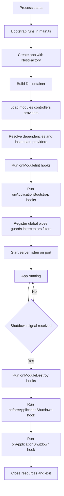
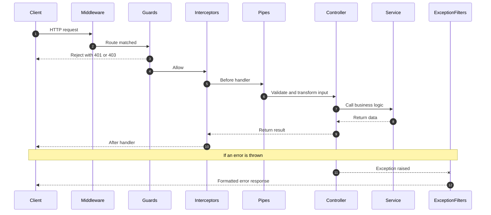

```mermaid
flowchart TD
  A[Process starts] --> B[Bootstrap runs in main.ts]
  B --> C[Create app with NestFactory]
  C --> D[Build DI container]
  D --> E[Load modules controllers providers]
  E --> F[Resolve dependencies and instantiate providers]
  F --> G[Run onModuleInit hooks]
  G --> H[Run onApplicationBootstrap hooks]
  H --> I[Register global pipes guards interceptors filters]
  I --> J[Start server listen on port]
  J --> K[App running]

  K --> L{Shutdown signal received}
  L -- No --> K
  L -- Yes --> M[Run onModuleDestroy hooks]
  M --> N[Run beforeApplicationShutdown hook]
  N --> O[Run onApplicationShutdown hook]
  O --> P[Close resources and exit]
```

```mermaid
sequenceDiagram
  autonumber
  participant Client
  participant Middleware
  participant Guards
  participant Interceptors
  participant Pipes
  participant Controller
  participant Service
  participant ExceptionFilters

  Client->>Middleware: HTTP request
  Middleware->>Guards: Route matched
  Guards-->>Client: Reject with 401 or 403
  Guards->>Interceptors: Allow

  Interceptors->>Pipes: Before handler
  Pipes->>Controller: Validate and transform input
  Controller->>Service: Call business logic
  Service-->>Controller: Return data
  Controller-->>Interceptors: Return result
  Interceptors-->>Client: After handler

  Note over Client,ExceptionFilters: If an error is thrown
  Controller--x ExceptionFilters: Exception raised
  ExceptionFilters-->>Client: Formatted error response
```
